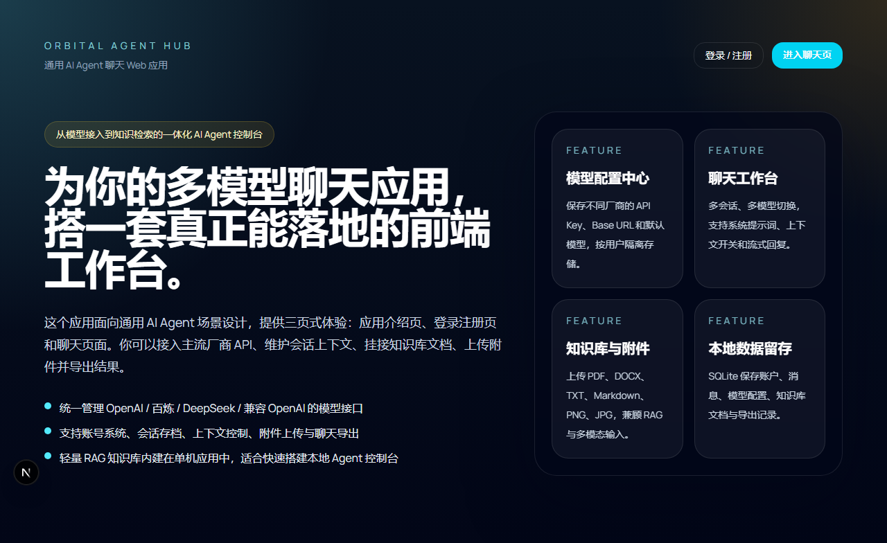
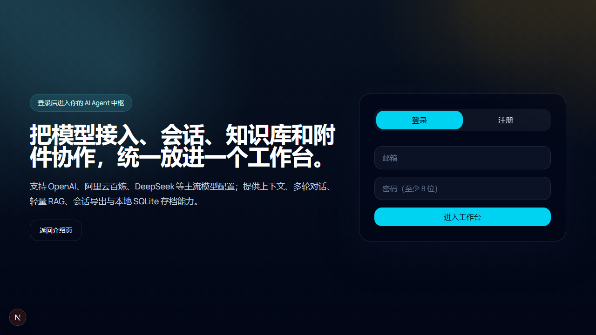

# Orbital Agent Hub

<div align="center">

**通用 AI Agent 聊天 Web 的应用**

*A Unified AI Agent Chat Web Application*

[](https://nextjs.org)
[](https://react.dev)
[](https://www.typescriptlang.org)
[](https://www.prisma.io)

[English](#english) | [中文](#中文)

</div>

---

## 🌟 预览 / Preview

### 首页 / Home Page



*现代化深色主题设计，展示应用核心功能*
*Modern dark theme design showcasing core features*

### 认证页面 / Authentication Page


*简洁的用户注册和登录界面*
*Clean user registration and login interface*

### 聊天工作台 / Chat Workspace



*三栏布局：会话管理 | 聊天区域 | 配置中心*
*Three-column layout: Session Management | Chat Area | Configuration Center*

---

## 📖 简介 / Introduction

### 中文
Orbital Agent Hub 是一个面向通用 AI Agent 场景的 Web 应用，提供从模型接入到知识检索的一体化控制台。

**核心特性：**
- 🔌 统一管理 OpenAI / 百炼 / DeepSeek / 兼容 OpenAI 的模型接口
- 📝 支持账号系统、会话存档、上下文控制、附件上传与聊天导出
- 🧠 轻量 RAG 知识库内建在单机应用中，适合快速搭建本地 Agent 控制台
- 🎨 现代化深色主题 UI，响应式设计

### English
Orbital Agent Hub is a web application designed for general-purpose AI Agent scenarios, providing an integrated console from model integration to knowledge retrieval.

**Key Features:**
- 🔌 Unified management of OpenAI / Bailian / DeepSeek / OpenAI-compatible model interfaces
- 📝 Account system, session archiving, context control, file upload, and chat export
- 🧠 Lightweight RAG knowledge base built into standalone application, perfect for quick local Agent console setup
- 🎨 Modern dark theme UI with responsive design

---

## 🚀 快速开始 / Quick Start

### 环境要求 / Requirements

- Node.js 18+ 
- npm / yarn / pnpm

### 安装步骤 / Installation

```bash
# 克隆仓库 / Clone repository
git clone https://github.com/ZengWenJian123/aiagent.git
cd aiagent

# 安装依赖 / Install dependencies
npm install

# 配置环境变量 / Configure environment variables
# 复制 .env 文件并修改配置 / Copy .env file and modify configuration
cp .env.example .env

# 初始化数据库 / Initialize database
npx prisma db push

# 启动开发服务器 / Start development server
npm run dev
```

### 访问应用 / Access Application

打开浏览器访问 / Open browser and visit:
```
http://localhost:3000
```

---

## 📁 项目结构 / Project Structure

```
aiagent/
├── prisma/
│   ├── schema.prisma      # 数据库模式 / Database Schema
│   └── dev.db             # SQLite 数据库 / SQLite Database
├── public/                # 静态资源 / Static Assets
├── src/
│   ├── app/
│   │   ├── api/           # API 路由 / API Routes
│   │   ├── auth/          # 认证页面 / Auth Pages
│   │   ├── chat/          # 聊天页面 / Chat Pages
│   │   ├── layout.tsx     # 根布局 / Root Layout
│   │   └── page.tsx       # 首页 / Home Page
│   ├── components/
│   │   ├── auth/          # 认证组件 / Auth Components
│   │   ├── chat/          # 聊天组件 / Chat Components
│   │   └── ui.tsx         # UI 基础组件 / Base UI Components
│   └── lib/
│       ├── auth.ts        # 认证逻辑 / Auth Logic
│       ├── providers.ts   # 模型提供商适配 / Model Providers
│       ├── rag.ts         # RAG 检索 / RAG Retrieval
│       ├── vector.ts      # 向量嵌入 / Vector Embedding
│       ├── documents.ts   # 文档解析 / Document Parsing
│       ├── schemas.ts     # Zod 验证 / Zod Validation
│       └── prisma.ts      # 数据库连接 / Database Connection
├── .env                   # 环境变量 / Environment Variables
├── package.json           # 项目配置 / Project Config
└── tsconfig.json          # TypeScript 配置 / TypeScript Config
```

---

## 🛠️ 技术栈 / Tech Stack

| 类别 / Category | 技术 / Technology |
|----------------|-------------------|
| **前端框架 / Frontend** | Next.js 16.2.1, React 19 |
| **语言 / Language** | TypeScript 5 |
| **样式 / Styling** | Tailwind CSS v4 |
| **数据库 / Database** | SQLite + Prisma ORM |
| **认证 / Authentication** | JWT + bcryptjs |
| **验证 / Validation** | Zod |
| **AI 集成 / AI Integration** | OpenAI API Compatible |

---

## 📋 功能模块 / Features

### 1. 用户认证 / User Authentication
- 用户注册 / 登录 (Register / Login)
- JWT Session 管理 (JWT Session Management)
- 基于 Cookie 的身份验证 (Cookie-based Authentication)

### 2. 模型配置中心 / Model Configuration Center
- 支持多厂商模型 (Multi-vendor Support)
  - OpenAI
  - 阿里云百炼 (Aliyun Bailian)
  - DeepSeek
  - 兼容 OpenAI 协议 (OpenAI Compatible)
- 每个用户可保存多个模型配置 (Multiple configs per user)
- 支持设置默认模型 (Default model setting)
- 支持视觉模型 (Vision model support)

### 3. 聊天工作台 / Chat Workspace
- 多会话管理 (Multi-session Management)
- 流式回复 (Streaming Response)
- 上下文控制 (Context Control)
- 系统提示词配置 (System Prompt Configuration)
- 消息记录持久化 (Message Persistence)

### 4. 知识库 RAG 系统 / Knowledge Base RAG
- 文档上传 (Document Upload): PDF, DOCX, TXT, Markdown
- 文本分块 (Text Chunking)
- 本地向量嵌入 (Local Vector Embedding)
- 相似度检索 (Similarity Search)
- 引用来源展示 (Citation Display)

### 5. 附件系统 / Attachment System
- 支持图片上传 (Image Upload): PNG, JPG, JPEG
- 多模态模型支持 (Multimodal Model Support)

### 6. 导出功能 / Export Features
- Markdown 格式导出 (Export as Markdown)
- JSON 格式导出 (Export as JSON)

---

## 🔧 环境变量 / Environment Variables

| 变量 / Variable | 说明 / Description | 示例 / Example |
|----------------|-------------------|----------------|
| `DATABASE_URL` | SQLite 数据库路径 | `file:./dev.db` |
| `AUTH_SECRET` | JWT 加密密钥 | `your-secret-key` |
| `NEXT_PUBLIC_APP_URL` | 应用访问地址 | `http://localhost:3000` |

---

## 📸 界面截图 / Screenshots

### 首页设计 / Home Page Design
- 深色渐变背景
- 功能特性卡片展示
- 快速导航按钮

### 聊天界面 / Chat Interface
- 左侧：会话列表 + 知识库管理
- 中间：聊天对话区域
- 右侧：模型配置中心

---

## 🤝 贡献 / Contributing

欢迎提交 Issue 和 Pull Request！

Issues and Pull Requests are welcome!

---

## 📄 许可证 / License

MIT License

---

<div align="center">

**Orbital Agent Hub**

*为你的多模型聊天应用，搭一套真正能落地的前端工作台*

*Build a truly practical frontend workstation for your multi-model chat application*

</div>